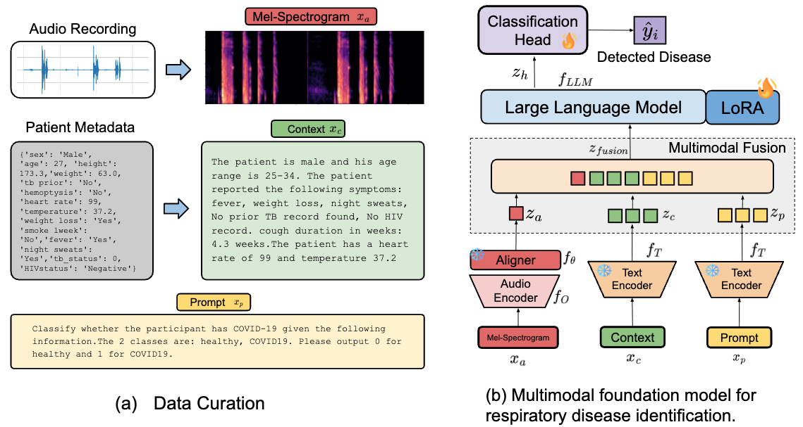

<div align="center">
 

# RespiraMFM: A Multimodal Foundation Model with Contrastive Audio-Language Alignment for Respiratory Disease Identification

<a href="https://2026.aclweb.org/"></a>
<a href="https://aiot-mlsys-lab.github.io/RespiraMFM.github.io/static/pdfs/RespiraMFM.pdf"></a>
<a href="https://aiot-mlsys-lab.github.io/RespiraMFM.github.io/"></a>

</div>

<div align="center">
 <br>
</div>

## Setup Environment
Use Anaconda to create a new environment and install the required packages. You can create a new environment and install the required packages using the following commands:
```bash
conda create -n respiramfm python=3.10.4
conda activate respiramfm
pip install -r requirements.txt
```

## Data pre-processing

### Dataset
| Dataset Name | Covered Disease | Dataset Link |
| :--- | :--- | :--- |
| UK COVID-19 | `Covid-19` | [View Dataset](https://www.nature.com/articles/s42256-023-00773-8) |
| Coughvid | `Covid-19` | [View Dataset](https://www.nature.com/articles/s41597-021-00937-4) |
| Coswara | `Covid-19`   | [View Dataset](https://www.nature.com/articles/s41597-023-02266-0) |
| TBscreen | `Tuberculosis` | [View Dataset](https://pmc.ncbi.nlm.nih.gov/articles/PMC10776005/) |
| CodaTB | `Tuberculosis` | [View Dataset](https://pmc.ncbi.nlm.nih.gov/articles/PMC11489852/) |
| ICBHI | `COPD` | [View Dataset](https://bhichallenge.med.auth.gr/ICBHI_2017_Challenge) |
| KAUH | `COPD`, `Asthma`, `Pneumonia` | [View Dataset](https://pmc.ncbi.nlm.nih.gov/articles/PMC8019351/) |


## Training
```bash
CUDA_VISIBLE_DEVICES=0 python src/train.py
```

## Evaluation
You can run the inference code using the following command 
to run on respiratory disease datasets. 
Download our pre-trained model weights from [here](https://buckeyemailosu-my.sharepoint.com/:f:/r/personal/siam_5_osu_edu/Documents/MyResearch/RespiraMFM/ACL_final_models?d=w161e63d8be484f84962c43e62b86c994&csf=1&web=1&e=qNNV1M)
into `model/` directory.
```bash
CUDA_VISIBLE_DEVICES=0 python src/evaluate.py
```

## Citation
```bibtex
@inproceedings{siam2026respiramfm,
title = {RespiraMFM: A Multimodal Foundation Model with Contrastive Audio-Language Alignment for Respiratory Disease Identification},
author = {Siam, Shakhrul Iman and Feng, Tiantian and Zhang, Jiankun and Narayanan, Shrikanth and Zhang, Mi},
booktitle = {Proceedings of the 64th Annual Meeting of the Association for Computational Linguistics (ACL)},
year = {2026}
}
```