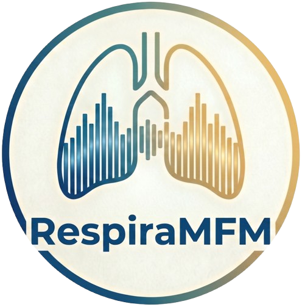

<div align="center">
 

# RespiraMFM: A Multimodal Foundation Model with Contrastive Audio-Language Alignment for Respiratory Disease Identification

<a href="https://2026.aclweb.org/"></a>
<a href="https://aiot-mlsys-lab.github.io/RespiraMFM.github.io/static/pdfs/RespiraMFM.pdf"></a>
<a href="https://aiot-mlsys-lab.github.io/RespiraMFM.github.io/"></a>

</div>

## Setup Environment
Use Anaconda to create a new environment and install the required packages. You can create a new environment and install the required packages using the following commands:
```bash
conda create -n respiramfm python=3.10.4
conda activate respiramfm
pip install -r requirements.txt
```

## Data pre-processing

## Training
```bash
CUDA_VISIBLE_DEVICES=0 python src/train.py
```

## Evaluation
You can run the inference code using the following command 
to run on respiratory disease datasets. 
Download our pre-trained model weights from [here](https://buckeyemailosu-my.sharepoint.com/:f:/g/personal/siam_5_buckeyemail_osu_edu/IgAA90FBALRCQrz-4pdxmWJMAVaajwrSrM3RZ2qBVBS0CBY?e=REeLMD)
into `model/` directory.
```bash
CUDA_VISIBLE_DEVICES=0 python src/evaluate.py
```
